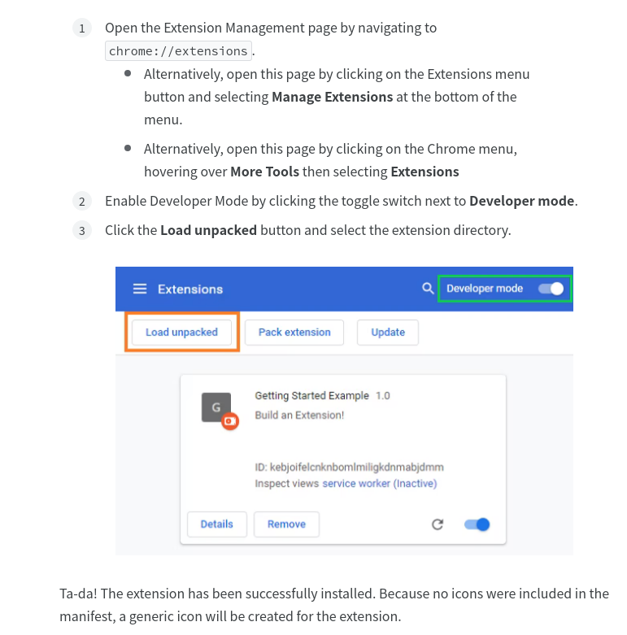
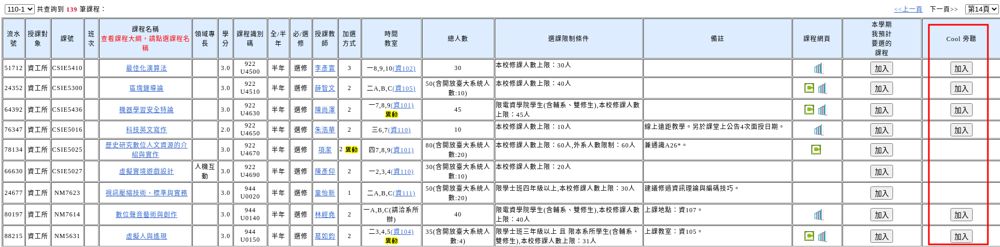
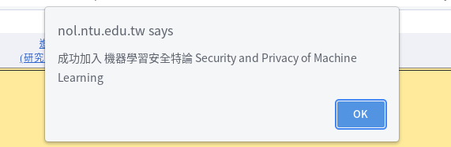
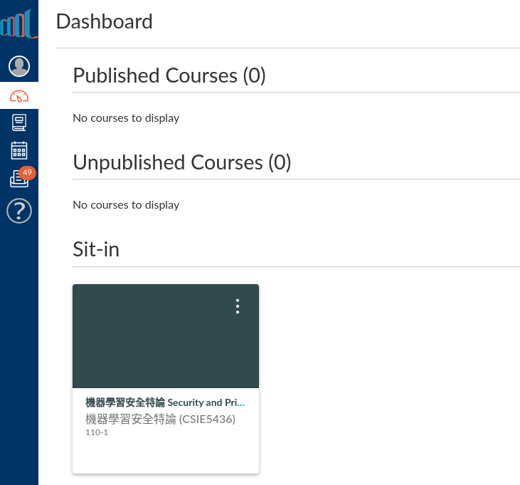
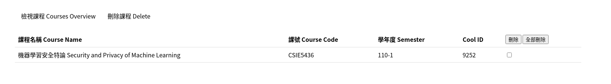

# NTU Cool Course Extension

將想要旁聽的課程新增到 NTU cool 的資訊總覽 (Dashboard) 及課程列表 (Courses)

## 安裝 Chrome Extension
見[官方教學](https://developer.chrome.com/docs/extensions/mv3/getstarted/)，步驟如下圖

成功安裝後，登入 NTU COOL 會看到多了 Sit-in 的部份。(如果要在無痕模式使用要開啟權限)

## 加入課程
進入[台大課程查詢頁面](https://nol.ntu.edu.tw/nol/coursesearch/search_result.php)，搜尋結果的表格會多一欄加入旁聽的欄位(如果該課程沒開在 NTU COOL 就不會有按鈕)

點選加入後，會通知是否加入成功。加入成功的條件要同時滿足該課程有開在 NTU COOL 並且有開放學生存取的權限。

再回到 NTU COOL，會發現課程已出現在資訊總覽 (Dashboard) 及課程列表 (Courses)。

## 管理課程

進入管理 Extension 的頁面 chrome://extensions

找到對應的 Extension 的 Details 按鈕 > 點 Extension options 就可以進入頁面。

如果要在無痕模式使用也是在 Details 那邊設定